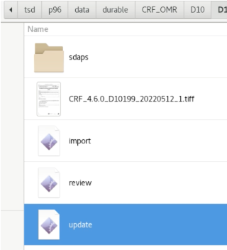

# OMR-CRF IMPORT TOOLING USER GUIDE

The OMR-CRF is a questionnaire that is generated using the [SDAPS](https://sdaps.org/) software to enable Optical Mark Recognition. To process filled CRFs and import their data into XNAT, we have developed a workflow that automates the different stages as much as possible.

This document provides the user guide of the software tooling that implements the OMR-CRF import functionality. Each step of the import pipeline and its related scripts/applications' usage instructions are described in a specific section.

- [OMR-CRF IMPORT TOOLING USER GUIDE](#omr-crf-import-tooling-user-guide)
- [Environment setup instructions](#environment-setup-instructions)
  - [CRF folders](#crf-folders)
    - [Accessing and bookmarking](#accessing-and-bookmarking)
  - [Execution behaviour](#execution-behaviour)
- [CRF import workflow](#crf-import-workflow)
  - [The workflow in a nutshell](#the-workflow-in-a-nutshell)
  - [Scan](#scan)
    - [Scanning](#scanning)
    - [Scanned file naming convention](#scanned-file-naming-convention)
  - [TSD import](#tsd-import)
  - [Search and detect scan files](#search-and-detect-scan-files)
  - [Review mark recognition](#review-mark-recognition)
    - [Checkbox recognition correction](#checkbox-recognition-correction)
    - [Filling free-text fields](#filling-free-text-fields)
  - [Update data with review changes](#update-data-with-review-changes)
  - [XNAT import](#xnat-import)
    - [Interface](#interface)
    - [Elements pane](#elements-pane)
      - [Element title](#element-title)
      - [Element XNAT ID](#element-xnat-id)
      - [View in XNAT button](#view-in-xnat-button)
      - [State indicator](#state-indicator)
    - [Import process](#import-process)
  - [Review in XNAT](#review-in-xnat)

# Environment setup instructions

The CRF files and script applications are located in specific folders in the TSD server. It is best to prepare shortcuts to these folders as well as configuring the execution behaviour for the script files. 
## CRF folders
The root folder to access is `/tsd/p96/data/durable/CRF_OMR`. It is organized site-wise, meaning there will be a folder per site named with the site's prefix. The final processed CRF folders lay in its site folder: 
```
CRF_OMR
|_D10
    |_ D10101_20221002_1
|_D20
.
.
.
```
### Accessing and bookmarking
To access `/tsd/p96/data/durable/CRF_OMR`, first open the file browser by clicking on *Places* in the main toolbar, then click on any item.


Then, on your keyboard, hold the control (ctrl) key and type l -> ctrl + l. This lets you edit the location, as you would do in a web browser. 


Type or paste `/tsd/p96/data/durable/CRF_OMR`, and hit enter to navigate to the folder. 


To avoid doing these steps each time, it is advisable to create a bookmark for the folder. To do this, navigate to `/tsd/p96/data/durable/`, locate the *CRF_OMR* folder icon, click and drag it to the left pane, just bellow the default system bookmarks, until a green *New bookmark* indicator appears:


Now you can click on the bookmark when you need to access the folder, regardless from the folder where you are.


## Execution behaviour
Most of the automated steps are implemented in small programs, called scripts, that run in the terminal. To be able to run them, we need first to define the behaviour for these type of files in the CRF folder. 

Once in the `CRF folder`, go to *Preferences* by clicking on the blue icon located at the top-right corner. 


Then *Behaviour* and make sure "Ask what to do" is selected


# CRF import workflow

## The workflow in a nutshell


The workflow consists of 7 steps to process an entire scanned CRF and import the recognized data into XNAT. 
1. **Scan**<br>
The scanner must be set to 300 DPI black and white, multipage TIFF, compressed. **The file must follow the [CRF naming convention](#scanned-file-naming-convention)** for the scripts to retrieve the relevant metadata information.
2. **Upload** the scanned `.tiff` file into TSD. <br>
Upload the desired `.tiff` files into TSD through the [TSD data portal](https://data.tsd.usit.no/).
3. **Search** and process imported CRF tiffs.<br>
Navigate to `/tsd/p96/data/durable/CRF-OMR` and double-click on `CRF search` script to "Run in terminal". 
4. **Review** the SDAPS recognition.<br>
Navigate to the generated folder, which will be in your site folder in `/tsd/p96/data/durable/CRF-OMR/{site-prefix}/{subject}_{date}_{assessment}`. Then, double-click on the `review` script to run it in a terminal and open the SDAPS review user interface. 
5. **Upade** review changes.<br>
In case you have made any changes to the mark recognitions, or have filled any of the text fields, double-click on the `update` script to run it in a terminal.
6. **Import** data into XNAT.<br>
The data should be ready to import! Open the import app by double-clicking on `import`. Then, click on *import* button for the process to start.
7. **Review** the final XNAT subject and experiments.<br>
Once the import is finished, browse the imported subject/experiments in XNAT to inspect and confirm that the created data is correct. 

## Scan
### Scanning
To work properly, the SDAPS recognition software needs a specific file format, so the scanner must be set to **300 DPI black and white, multipage TIFF, compressed**.

### Scanned file naming convention
The scripts that read the scanned CRF use the file name to recognize critical pieces of information: 
- The CRF version
- The subject
- Date of the CRF
- Assessment number

To be processed correctly, the file has to follow the following pattern:

`CRF_{version}_{subject}_{date}_{assessment}`

> :memo: For example, from `CRF_4.6.0_D10199_20220512_1` the scripts would detect that the CRF is v4.6.0, for the subject D10199, on 2022-05-12 for the first assessment. 

## TSD import
To import scan files into TSD browse to the [TSD data portal](https://data.tsd.usit.no/) and click import files.


Authenticate with your TSD credentials and password as usual. Then, browse the file you want to import. You can add as many file as you need, and then import them at once. 

## Search and detect scan files
Once you have imported the scan file(s), it is available in the TSD storage space. Now we can execute the program that looks for CRF scans and process them :robot:

Navigate to the CRF_OMR folder (it should be in your bookmarks already), and double-click to run `CRF search` in the terminal.


The `CRF search` program does several things:
1. Find scan files in the TSD import folder.
2. Place the files in the proper folder, according to site prefix ID. 
3. Launch the SDAPS mark recognition and export the recognized data.

You will see the processing in the terminal, once it is finished, you can navigate to the resulting folder inside your site. This folder follows the format `{subject}_{date}_{assessment}`, as detected in the scan file name. 

> :memo: Following the same example as before, `CRF_4.6.0_D10199_20220512_1` would end in `CRF-OMR/D10/D10199_20220512_1`

In the final processed folder you will find several items.
- A folder named *sdaps*, which contains the internal data and files for the recognition.
- The scanned TIFF file.
- The scripts
  - review
  - update
  - import


The scripts are what you need to interact with, being `review` the next step of the pipeline. 

## Review mark recognition

OMR software is not infallible; SDAPS can make mistakes when deciding whether a checkbox is checked. Also, sometimes the person may have made a mistake when filling out the questionnaire. 

To overcome this situation, SDAPS provides a graphical user interface to review and correct any such problems that you may detect. The user documentation can be found [here](https://sdaps.org/documentation/gui/). To launch it, double-click on the `review` script to run it in the terminal.  
   


The user interface is pretty simple. It is comprised of two panes, one on the left to show the recognition over the scanned pages and another on the right with the questionnaire items and the values detected. SDAPS shows checkboxes recognized as `checked` highlighted in green.


### Checkbox recognition correction

To correct recognition errors or change the selection, you can check/uncheck by clicking on them, as you would do in a typical digital form. The same way, you can correct on the right pane, from the data recognition. 

In the following example, SDAPS detects as checked one half-stroke checkbox. Normally, single-selection layouts only allows for one checked, and SDAPS won't export the data for 3.9. You would need to uncheck the error to fix and obtain accurate data. 


### Filling free-text fields

SDAPS provides text fields and recognize when these are filled, but it is unable to recognize the content, such as OCR would do. However, you can enter the text content in SDAPS GUI and it would be then included in the exported data. 


> :heavy_exclamation_mark: Because we have had to do some "hacks" to obtain the layouts we needed for some questions, the internal SDAPS count of some of the items doesn't match what you see on the paper. Follow along the items to make sure which one to edit on the right pane when in doubt. This problem is more likely to appear when editing text fields. 

Once you are done reviewing the CRF, you can quit the application. **If you have made changes click on File->Save** or select save before quitting. 

## Update data with review changes

Once you have saved your changes, SDAPS updates the internal values of the questionnaire, but before importing, we need to export that data to a CSV file for the import app to read.

Double-click on the `update` script to run the SDAPS export, and we are ready to import.



## XNAT import

Now we are ready to import the data recognized from the CRF! Double-click on the `import` script to run the XNAT import app in the terminal. 


This app will create and fill all XNAT elements that match the CRF for you. It also uploads the scanned CRF to be stored in the XNAT subject resource. 
The app is designed to show only several pieces of important information and give the functionality to import and view a resource in XNAT when it exists. 


### Interface

The user interface is comprised of 3 main zones, the file scan name caption, the XNAT elements pane and the import pane. 


### Elements pane
The elements pane displays the XNAT subject and experiment elements that belongs to the CRF to import.


#### Element title
Indicates to which element the information belongs to. 

#### Element XNAT ID
The XNAT IDs are autogenerated from the subject ID, CRF date and assessment that the script detects. The ID show will be the one used in the import.

#### View in XNAT button

When the app detects that an element exists in XNAT, it enables the *View in XNAT* button. When clicked, the button opens the element in XNAT in a new web browser tab.

#### State indicator
The state indicator gives app and XNAT state with color codes:
- Red: the element doesn't exist in XNAT.<br> 
- Blue: the element exists in XNAT.<br>  
- Green, the element was successfully created. <br> 

### Import process

To start the import, click on the `import` button at the lower left corner in the import pane. 

The app will start creating the elements and importing the variables one by one. If an element already exists, a dialog will ask if you want to overwrite the existing data or skip the element. 


> :memo: It is therefore possible to correct/update the questionnaire with the `review` any times you need. You can decide which data to overwrite at import time. 

## Review in XNAT 

The data is in XNAT! But it is very important to inspect the data that was set from the import process. You can easily browse the different elements by clicking in its correspondent *View in XNAT* button. If you click at subject level, it will bring you to the subject summary page in XNAT.


Once you done checking the experiment, the import process is finished :v: